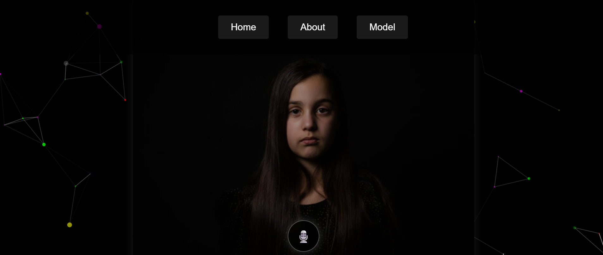

This is a **Flask-based conversational web app** where users can record voice input, which is then:

- 🎤 Transcribed using **Google Speech Recognition**
- 🤖 Sent to **Google Gemini API** for generating a text response
- 🔊 Converted to **speech output (MP3)** using **Google Cloud TTS** or **gTTS**
- 📽️ Played back with a **demo talking video loop** (pre-rendered or real-time with Wav2Lip)

---

## ✨ Features

- 🌐 Web interface built with **Flask** and **HTML templates**
- 🎧 Converts WebM audio to WAV using `ffmpeg` for **speech-to-text**
- 🧠 Uses **Gemini API** (Google Generative AI) to generate smart, concise replies
- 🔊 Converts response to audio using **Google Cloud TTS** or fallback **gTTS**
- 🧪 Plays back voice with a **demo video**, simulating real-time speaking
- 🗂️ Maintains **conversation session history**
- 🔁 Wav2Lip-based **lip-synced video generation** (optional, demo available)

---

## 🔑 Environment Variables

Create a `.env` file or set these in your shell:

```bash
GOOGLE_API_KEY=your-gemini-api-key
FLASK_SECRET=your-flask-secret-key
✅ GOOGLE_API_KEY is required for Gemini API integration.

🔧 Installation & Setup
Clone the repository

Install dependencies:

bash
Copy
Edit
pip install -r requirements.txt
Run the app:

bash
Copy
Edit
python app.py
Open in your browser:
http://localhost:5000

🧠 Gemini API Integration
The app sends user transcriptions as prompts to Gemini 2.0 Flash model using your API key.
Responses are kept short (20 words max) using a system message.

🗣️ Text-to-Speech
The assistant voice is generated using:

✅ Google Cloud TTS (if available)

🔁 Fallback: gTTS (no auth required)

📽️ Wav2Lip (Optional Real-Time Talking Video)
You can use Wav2Lip to generate lip-synced video responses.

Requires ~3GB of space

Uses hparams.py, inference.py, etc.  and a pre-trained model which lies in wav2lip
 
Requires environment setup (Python version, PyTorch, OpenCV, etc.)

All setup instructions and files are available in the repo

📁 Attached Media
✅ Sample output videos using Wav2Lip

✅ UI Screenshots & output responses

✅ Pre-rendered fallback talking demo video

📦 Requirements
txt
Copy
Edit
Flask
speechrecognition
gtts
google-cloud-texttospeech
requests
ffmpeg-python
## 📸 Demo Screenshots

### 🖼️ LLM Interface & Input  


### 🖼️ Gemini Output and TTS Response  


🖼️ Gemini Output and TTS Response

📂 Make sure these images are located inside static/images/ or update the path accordingly.

📚 Credits
Google Gemini API

Google Cloud Text-to-Speech

gTTS

Wav2Lip

FFmpeg

📌 Notes
ffmpeg must be installed and accessible via system PATH

You can use either a static demo video or integrate Wav2Lip for dynamic, real-time video

Manage API rate limits and file sizes before deploying the app publicly

